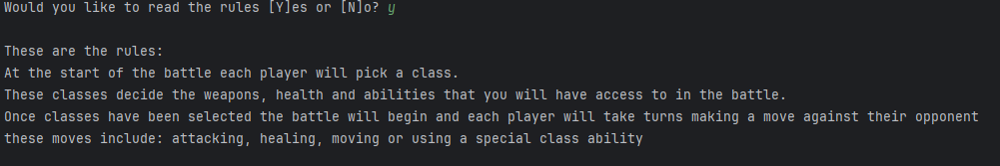
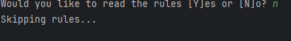
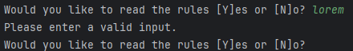

# Results of Testing

The test results show the actual outcome of the testing, following the [Test Plan](test-plan.md)

---

## Asking the user if they want to read the rules

I will enter valid and invalid inputs into the rules prompt and record the outcomes

### Test Data Used

valid = Y, N, y, n (in order to check whether the intended outcomes are reached)
Invalid = 1 (to make sure it refuses int inputs), lorem (to make sure it refuses string inputs), g (to make sure it refuses chars other than y and n), a blank input to check that it refuses them 

### Test Result

as expected on entry of valid inputs correct outcomes are achieved and on invalid inputs the user is prompted to renter another input

---

## Player setup: --------------------------------------------------
* p1Name/p2Name = test of getString() 
* descClass()
* p1Class/p2Class = test of chooseClass() function & getString()

## -------------------------------------------------------------------

### String retrieval aka user input e.g. getting player names and class input

the getString() function when used should ask the user to enter a string by printing the
prompt defined in the function call, when a string is received it should be checked if it is blank if it is ask
for a new string if it does contain a valid then return it

to test this I will use the assignment of p1Name and the assignment of the value userInput in the chooseclass function

#### Test Data Used
I will enter the following data into the relevant fields:

p1Name:
valid: "Jeve Stobs" (for string check), 42 (check if ints are taken as strings), b (check if chars are taken as strings)
invalid: blank input (to check if it is refused)

userInput:
valid: "Fighter", 42, z
invalid: blank input (to check if it is refused)

#### Test Result
p1Name is shown as name in the following images 
userInput is shown as Class in the following images:

p1name:  

Jeve Stobs:  
JeveStobsP1Name.png)  
    
42:  

    
b:  
  
    
blank:  
  

Comment on test result. Comment on test result. Comment on test result. Comment on test result. Comment on test result. Comment on test result.

---

