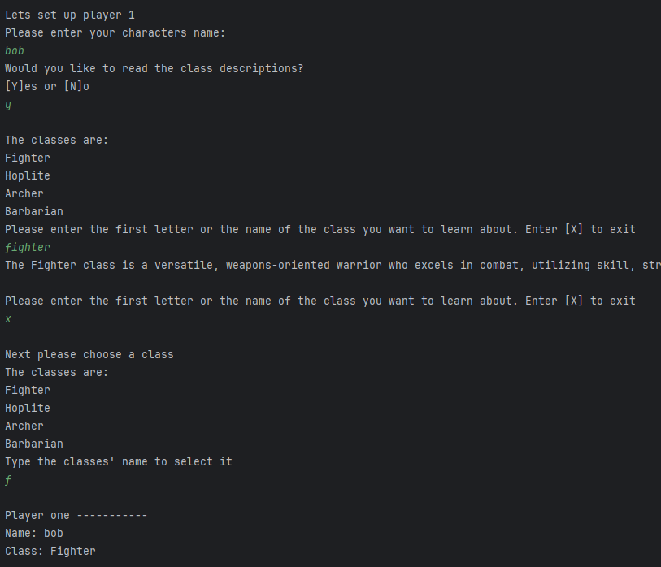
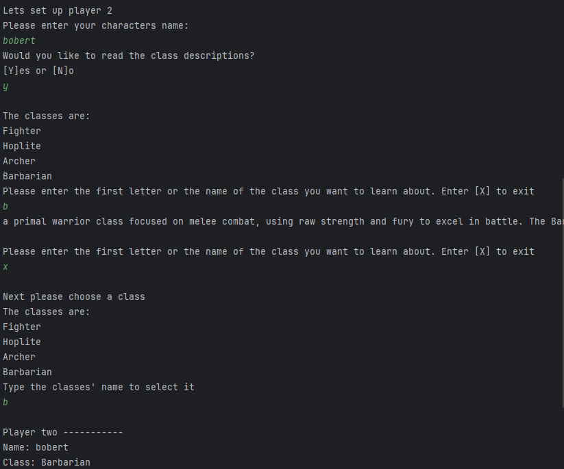
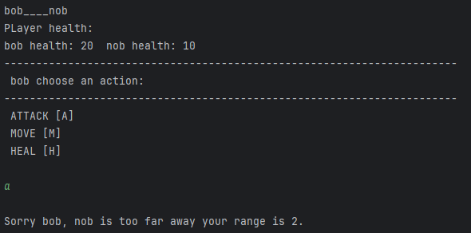
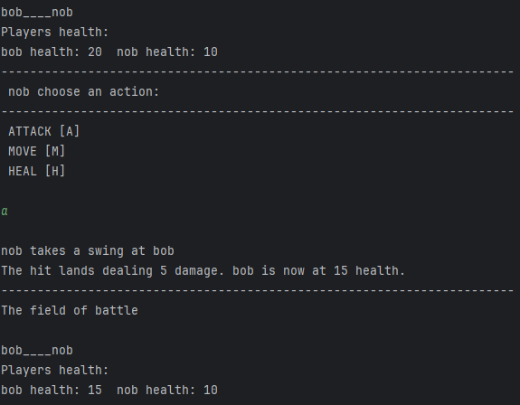
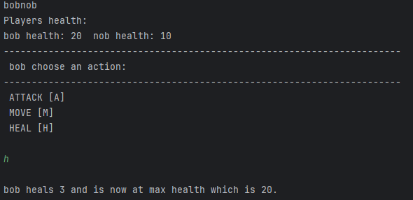
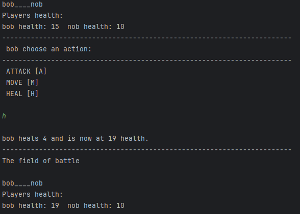
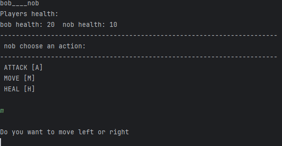

# Results of Testing

The test results show the actual outcome of the testing, following the [Test Plan](test-plan.md)

---

## Asking the user if they want to read the rules

I will enter valid and invalid inputs into the rules prompt and record the outcomes

### Test Data Used

#### valid: 
    Y, N, y, n (in order to check whether the intended outcomes are reached)
#### Invalid: 
    1 (to make sure it refuses int inputs), lorem (to make sure it refuses string inputs), g (to make sure it refuses chars other than y and n), a blank input to check that it refuses them 

### Test Result

---

---

---

---
As expected on entry of valid inputs correct outcomes are achieved and on invalid inputs the user is prompted to renter another input

---

## Player setup: 
* p1Name/p2Name = test of getString() 
* descClass()
* p1Class/p2Class = test of chooseClass() function & getString()

### String retrieval aka user input e.g. getting player names and class input

the getString() function when used should ask the user to enter a string by printing the
prompt defined in the function call, when a string is received it should be checked if it is blank if it is ask
for a new string if it does contain a valid then return it

to test this I will use the assignment of p1Name and the assignment of the value userInput in the chooseclass function

#### Test Data Used
I will enter the following data into the relevant fields:

#### p1Name:
    valid: "Jeve Stobs" (for string check), 42 (check if ints are taken as strings), b (check if chars are taken as strings)
    invalid: blank input (to check if it is refused)

#### userInput:
    valid: "Fighter", 42, z
    invalid: blank input (to check if it is refused)

#### Test Result
p1Name is shown as name in the following images 
userInput is shown as Class in the following images:
---

Jeve Stobs:  
JeveStobsP1Name.png)  
    
42:  
42P1Name.png)
    
b:  
bP1Name.png)  
    
Blank:  
blankP1Name.png)  

As expected on entry of valid inputs correct outcomes are achieved and on invalid inputs the user is prompted to renter another input

---
## descClass
The user will be asked whether they wish to read the descriptions of the classes and be poormpted with a y or n answer
on entry of n the program will move onto the next function ignoring the rest of descClass(). On entry of y the user will
be shown a list of the classes and be prompted to entry the first letter of the classes name in order to read about it
on entry of a letter the respective classes description will be printed and then the user will be asked if they wish to read another
description. On entry of the char x the loop will be broken and the program will move onto the next function

#### Test data used

#### userinput 1
    valid: y, n
    invalid: word, 72, x, blank
#### userinput 2
    valid: f, b, h, a, x, fighter, barbarian, hoplite, archer
    invalid: word, 72, c, blank
    
#### Test result

#### userinput 1  
y
_y_userinput_1.png)

---

n  
_n_userinput_1.png)

---

word  
_word_userinput_1.png)

---

72  
_72_userinput_1.png)
---

c  
_c_userinput_1.png)

---

blank
_blank_userinput_1.png)
-- Originally when a blank input is entered the error string would not be printed and the prompt to enter an input would just be repeated this was fixed by adding an else statement to the getString() function which is used by getChar() which prints the error string 
_blank_userinput_1_fixed.png)
---

#### userinput 2
f  
_f_userinput_2.png)
---
b
_b_userinput_2.png)
---
h
_h_userinput_2.png)
---
a
_a_userinput_2.png)
---
x
_x_userinput_2.png)
---
fighter
_fighter_userinput_2.png)
---
barbarian
_barbarian_userinput_2.png)
---
hoplite
_hoplite_userinput_2.png)
---
archer
_archer_userinput_2.png)
---
cheese
_cheese_userinput_2.png)
---
29
_29_userinput_2.png)
---
i
_i_userinput_2.png)
---
blank
_blank_userinput_2.png)
---

## Full Setup
When the full setup runs the user will be asked for their name, whether they
want to read the class descriptions and then asked what class they want to choose
and finally these choices are displayed to the players

descClass():
The user can choose whether to read the class descriptions with y or n then
if they chose yes then they can enter the first letter of the class they wish to
read about or type x in order to exit and continue to class selection

Contains getString(),descClass(),chooseClass()

### Test data used 
#### getString():
    valid: "bob"
#### descClass():
    valid would you like to read: y
    valid choose class to read about: f,x (to test exiting class descriptions)
#### chooseClass():
    valid:f

#### Test result:
below is a screenshot that shows all the inputs for the setup of player one and these inputs being shown at the end to the players 

## player 2 setup
This should work the same as player 1 setup but addressed to player 2 instead

### Test data

#### getString():
    valid: "bobert"
#### descClass():
    valid: y
    valid: b, x
#### chooseClass():
    valid:b

#### Test result:

## playerAction

### Test data

#### playerAction
    valid: a in range, a out of range,h,m
#### attack
    N/A
#### heal
    N/A
#### move
    valid:  l,r

#### Test result:

#### playerAction
a out of range

a in range

h at max health (Boundary test)

h below max health 

m

#### move
l at a greater distance from the other player than movement (Boundary test)

l at a lesser distance from the other player than movement

r at a greater distance from the other player than movement 

r at a lesser distance from the other player than movement (Boundary test)